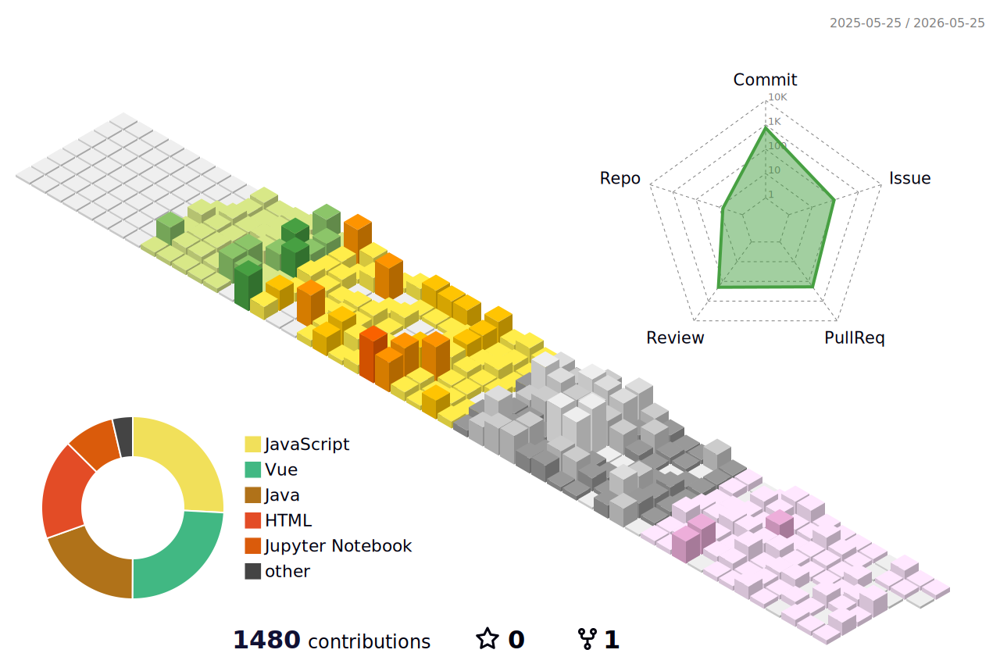

## 👋 About Me

도메인 지식과 소프트웨어 기술을 결합해 **정확한 데이터를 적시에 제공하고, 사용자의 의사결정을 돕는 서비스**를 만드는 데 관심이 있습니다.
현재는 CCTV, 태블릿 등 카메라 획득 영상 기반 하천 유속·유량·유사량 분석 솔루션을 제공하기 위해 **Python**과 **OpenCV**를 활용한 컴퓨터 비전 기술을 연구/개발하고, 측정된 데이터를 안정적으로 처리하고 가공하여 좋은 품질의 정보를 제공하기 위한 시스템을 개발하고 있습니다.

이 과정에서 **Kotlin**을 이용한 서비스 개발, **PostgreSQL** 기반의 데이터 관리 등 새로운 기술 스택을 적극적으로 학습하며 전문성을 확장하고 있습니다.

---

## 🌱 Currently Learning

|         Focus Area          | Description                                              |
| :-------------------------: | :------------------------------------------------------- |
|   👁️ **Computer Vision**    | OpenCV, Python을 활용한 영상 분석, 영상 품질 관리 및 객체 추적 기술 |
|   📊 **Data Engineering**   | PostgreSQL 기반 데이터 모델링 및 대용량 데이터 처리      |
|   📱 **App Development**    | Kotlin을 활용한 안드로이드 서비스 앱 개발                |
| 🤖 **AI Quality Assurance** | AI 서비스 품질 검증 방법론 연구                          |
|         📊 **DBA**          | 쿼리 최적화                                              |
|        🔧 **DevOps**        | 쿠버네티스 및 MSA                                        |

---

## 🛠 Tech Stack

| Category            | Technologies                                                                                                                                                                                                                                                                                                                                                                                                                                                                                                                                                                                                                                 | Proficiency                                                                         |
| :------------------ | :------------------------------------------------------------------------------------------------------------------------------------------------------------------------------------------------------------------------------------------------------------------------------------------------------------------------------------------------------------------------------------------------------------------------------------------------------------------------------------------------------------------------------------------------------------------------------------------------------------------------------------------- | :---------------------------------------------------------------------------------- |
| **Backend**         |       |          |
| **AI / Data**       |                                                                                                                                                                                                                                                                                                                                                                                                                                        |          |
| **Frontend**        |                                                                                                                                                                                                                                                                                                                                                                                                                        |  |
| **Mobile**          |                                                                                                                                                                                                                                                                                                                                                                                                                                                                                                                                           |          |
| **DevOps**          |                                                                                                     |  |
| **Version Control** |                                                                                                                                                                                                                                                                                                                                                                                                                                                                                                                                                   |      |

---

## 📊 GitHub Stats

---

## 💪 Core Competencies

|     | Skill                   | Description                                                   |
| :-: | :---------------------- | :------------------------------------------------------------ |
| ☕  | **Backend Development** | Java, Spring MVC/Boot 기반 REST API 개발                      |
| 🗄️  | **Database**            | MySQL + JPA/MyBatis 기반 데이터 설계 및 쿼리 최적화           |
| 🤝  | **Collaboration**       | 애자일 협업 중심의 개발 프로세스(문서화, 코드 리뷰, Git-Flow) |
| ⚡  | **Concurrency**         | Redis 기반 동시성 처리                                        |
| 📈  | **Performance**         | APM 연동 및 부하 테스트                                       |

---

## 🚀 Featured Projects

### 🐾 Meow Coffee (WMS) | Spring MVC 팀 프로젝트

> 창고 관리 시스템 (Warehouse Management System)

|               |                                                                                                                                               |
| :------------ | :-------------------------------------------------------------------------------------------------------------------------------------------- |
| **역할**      | 팀장, 입고 관리 파트 설계/구현                                                                                                                |
| **핵심 구현** | 입고(부하 시각화·추천 위치), 재고(QR 추적), 문서화(입고 지시서 PDF)                                                                           |
| **기술 스택** | `Java 17` `Spring MVC` `MyBatis` `MySQL` `JSP/ES6` `Bootstrap` `Tomcat`                                                                       |
| **Links**     | [📂 Repository](https://github.com/SSG9-1-meow-meow/Meow-coffee) · [📋 Portfolio](https://www.notion.so/WMS-2b4a84820e1380809270f19ed6dcdafb) |

### 🍱 LunchGO | 직장인 점심 예약/추천 서비스

> KDT 신세계 I&C 백엔드 과정 **최우수팀** 🏆

|               |                                                                                                                                                                     |
| :------------ | :------------------------------------------------------------------------------------------------------------------------------------------------------------------ |
| **역할**      | 팀장, 추천 알고리즘/리뷰 모듈, 결제, 동시성 제어, AI 인사이트, 서버 아키텍처 설계 및 APM 연동/모니터링, 부하테스트, 일정 관리                                       |
| **핵심 구현** | 추천(트렌딩·구내식당 대체 - OCR 연동), 결제(PortOne·웹훅), 리뷰(블라인드 처리·금칙어·쿼리 최적화·CRUD), Redis 비동기 집계, 예약 생성 동시성 제어, 로그인 부하테스트 |
| **기술 스택** | `Spring Boot` `MySQL` `Redis` `JPA` `MyBatis` `Vue 3` `Tailwind` `Docker` `Scouter` `Prometheus` `Grafana` `K6`                                                     |
| **Links**     | [📂 Repository](https://github.com/SSG9-FINAL-LunchGO/LunchGO)                                                                                                      |

---

## 🏆 Solved.ac

---

**Thanks for visiting!** 🙏

